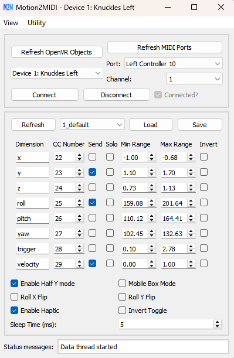

# Motion2MIDI

Motion2MIDI is a software tool to stream coordinate data from OpenVR controllers to MIDI CC allowing for control of synths with motion. The system is designed for use with a room-scale VR system, but does not require wearing of a headset to be used in live performance settings.

https://github.com/user-attachments/assets/db3eeb01-23dd-4bc3-98fa-e530140c2ca7

The program has been tested mainly with Valve Index controllers connected to SteamVR, but also has been tested with Vive Trackers. Some features include 

* Position (x,y,z), orientation (roll, pitch, yaw), velocity, and trigger press sent out as CC values
* Set min/max ranges for each dimension on the fly. 
* Haptic feedback with y dimension.
* 'Half y mode' to change trigger to change the y dimension mapping into a pulse (instead of smooth ramp).
* Multi-controller program to send distance between two controllers as CC.

## Installation

Download the latest zip file on the releases page and unzip. There are two folders, Motion2MIDI and Motion2MIDI Multi-Device. 

* Motion2MIDI (`src/main.py`): Main program to stream data from one controller to one MIDI port. 
* Motion2MIDI Multi-Device (`src/multi-device.py`): Can spawn multiple instances of Motion2MIDI in order to obtain the distance between two controllers and stream that to a third MIDI port. 
    * Note that multiple indepenent intances of Motion2MIDI can be started without this program if they are just going to be used independently. 

The software has been tested sending to a DAW through a virtual MIDI port such as [LoopMIDI](https://www.tobias-erichsen.de/software/loopmidi.html).

### Using the SteamVR Null Driver 

It is possible to use the software with SteamVR running normally but I normally run it in 'No HMD' (head mounted display) mode. See [here](https://github.com/username223/SteamVRNoHeadset) for instructions to switch to no hmd mode. In this repository there are initial scripts to automate this process in `src/m2m/utils/steamvr_config`.

## Usage

1. Start SteamVR and connect controllers/trackers.
2. Press 'Refresh OpenVR Objects/MIDI Ports' and select the OpenVR object and MIDI port you want to connect and press Connect. 
3. By default MIDI will not be sent until 'toggled'. This is the trackpad on the valve index. Alternatively, the 'invert toggle' checkbox can be checked. If all goes right, the status message should indicate that 'active mode' has been entered and the MIDI should be sending
    * open the Utility -> Midi Listener to debug. 
4. To change the 'box' that defines the min and max positions corresponding to 0-127 for the CC value, enter range set mode. Press 'b' on the index controller, or Utility->Range Set Mode. 

Some other Capability
- Ranges and other settings can be saved with the 'Save/Load' buttons. These settings are located in `_internal/settings` of the downloaded executable folder and `src/settings` of the repository. 
- Obtaining angles can give strange behavior in certain directions depending on the room orientaion. The roll X and Y flip add -1 in the rotation matrix roll calculalation to change the room orientaiton. 
- Mobile box mode is intended to move the box (x,y,z ranges) when the toggle is enabled such that the controller position is at the previous location the toggle was disabled
- Sleep time is the minimum time the active mode while loop must take. If this is too low with many dimensions sending the DAW can become overwhelmed.

## Development

tested with python 3.11

Install a requirements file in reqs
